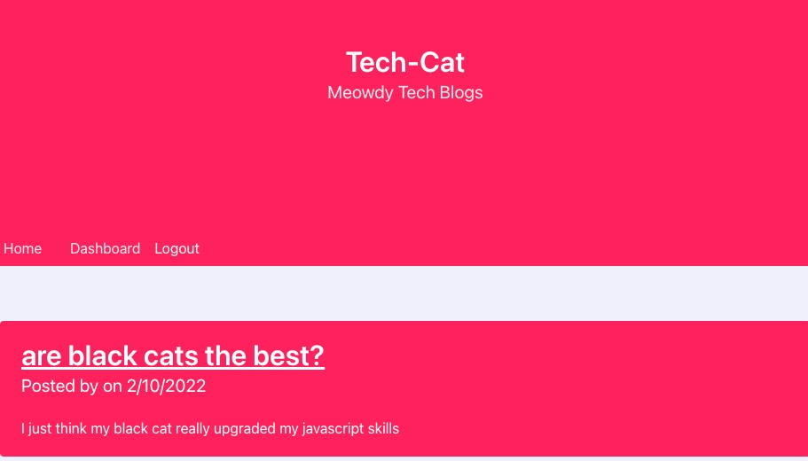

# Tech-Blog

## Description

This application allows users to post and track tech related blogs.

## Table of Contents

- [Installation](#Installation)
- [Usage](#Usage)
- [Contributions](#Contributions)
- [Testing](#Testing)
- [License](#License)
- [Questions](#Questions)

## Installation

Refer to deployed application's link.

## Usage

To create and interact with tech related blogs.

## Contributions

No contributions.

## Testing

Open deployed application's link.

## License

This project has an MIT license.
https://opensource.org/licenses/MIT

## Questions

Need to reach me?

- Email: michvalenz27@gmail.com
- [GitHub](https://github.com/MichValenz/Tech-Blog)
